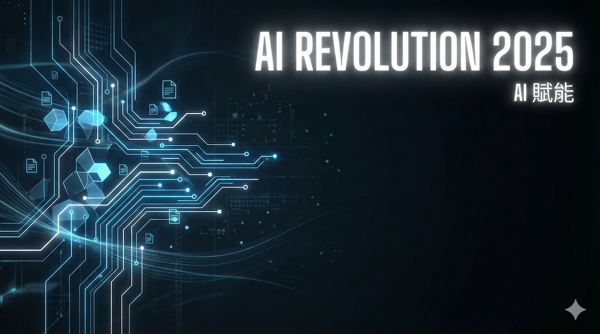
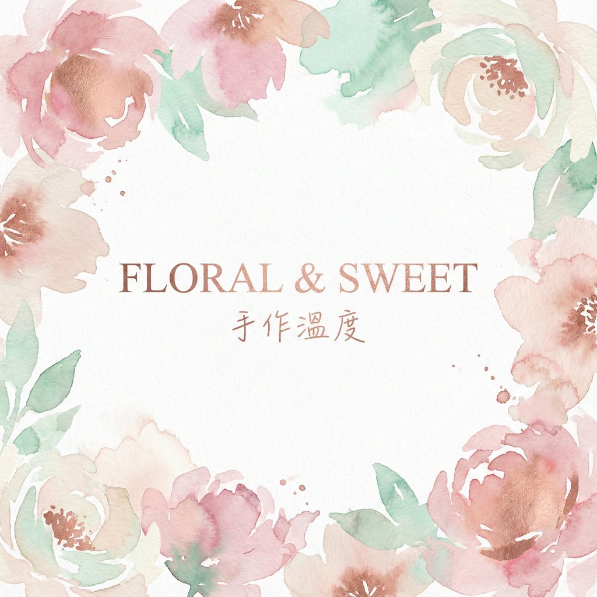

# 第 1 堂：零成本設計概論 - 對話即設計

- **主題**：AI 生成素材 + Affinity 基礎介面
- **工具**：Microsoft Designer + Affinity Designer
- **重點方向**：
    - **自然語言溝通術**：學習形容詞堆疊法（情緒 + 光影 + 材質 + 構圖）。
    - **Affinity 快速上手**：理解圖層 (Layer)、遮色片 (Mask) 與 向量 (Vector) 的基本觀念。
    - **工具辨證**：建立判斷標準——什麼時候該用 Canva (求快)？什麼時候該用 Affinity (求精)？
- **實作產出**：一組個人商業名片（AI 生成主視覺，Affinity 排版完稿）。

## 雙軌實戰任務 (Dual-Track Specs)
#### **第 1 堂：零成本設計概論 - 個人名片設計**

- **學習主軸**：AI 生成抽象背景 + Affinity 文字排版。
- **【主題 A：AI 科技顧問】**
    - **風格**：**科技極簡 (Tech Minimalist)** - 藍光、線條、幾何。
    - **參考文案內容 (Reference Copy)**：
        - **標題**：未來視界，智慧領航
        - **副標題**：AI 賦能，重塑您的商業競爭力
        - **內文**：我們提供最前沿的人工智慧解決方案，助您在數位轉型浪潮中搶佔先機。
    - **Prompt 進階三部曲 (由淺入深)**：
        1. **Lv1 (基礎)**：`Tech background, minimalist, copy space. (科技背景，極簡，留白)`
        2. **Lv2 (中階)**：`Abstract technology background, blue lines, simple, clean layout for text. (抽象科技背景，藍色線條，簡單，適合文字的乾淨版面)`
        3. **Lv3 (高階)**：`Abstract technology background, circuit board lines, neon blue and white gradient, minimalist style, 8k resolution, negative space on the right for title and body text, clean composition. (抽象科技背景，電路板線條，霓虹藍白漸層，極簡風格，8k 高解析度，右側留白供標題與內文排版，乾淨構圖)`
    - **範例作品**：
      
- **【主題 B：花藝/甜點師】**
    - **風格**：**莫蘭迪色調 (Morandi/Soft)** - 水彩、暈染、柔和。
    - **參考文案內容 (Reference Copy)**：
        - **標題**：花語甜心，味蕾綻放
        - **副標題**：手作溫度，傳遞最真摯的心意
        - **內文**：精選當季花材與天然食材，為您打造獨一無二的視覺與味覺饗宴。
    - **Prompt 進階三部曲 (由淺入深)**：
        1. **Lv1 (基礎)**：`Watercolor background, soft, copy space. (水彩背景，柔和，留白)`
        2. **Lv2 (中階)**：`Abstract watercolor background, pastel colors, soft, clean center. (抽象水彩背景，粉彩色調，柔和，中間乾淨)`
        3. **Lv3 (高階)**：`Abstract watercolor background, soft pastel colors, floral shapes, artistic texture, elegant vibe, clean space in the center for text, negative space for logo. (抽象水彩背景，柔和粉彩，花卉形狀，藝術紋理，優雅氛圍，中間乾淨留白供文字使用，適合放置 Logo)`
    - **範例作品**：
      