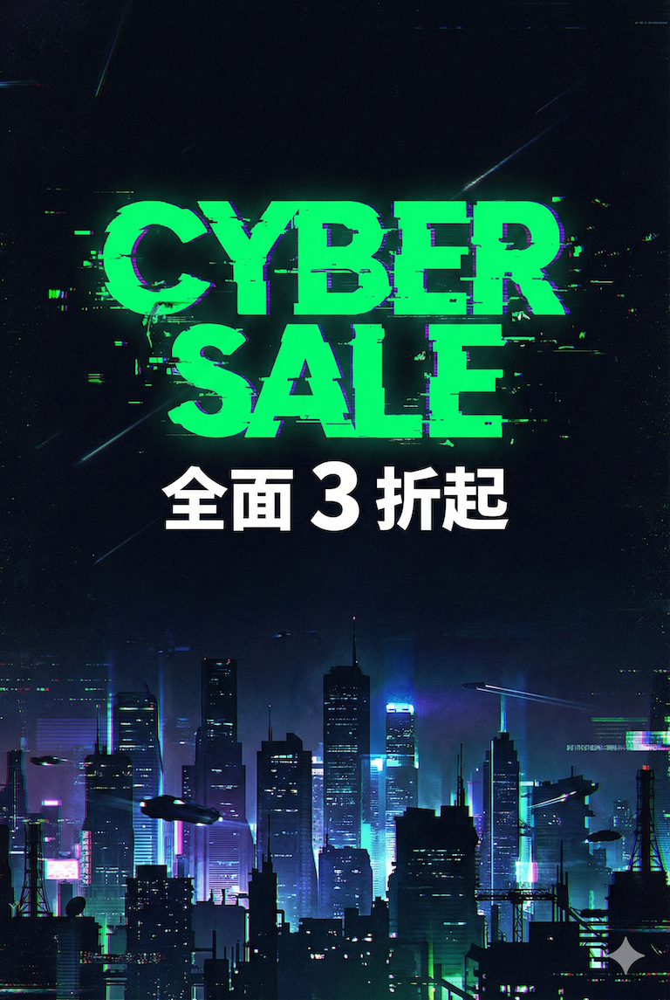
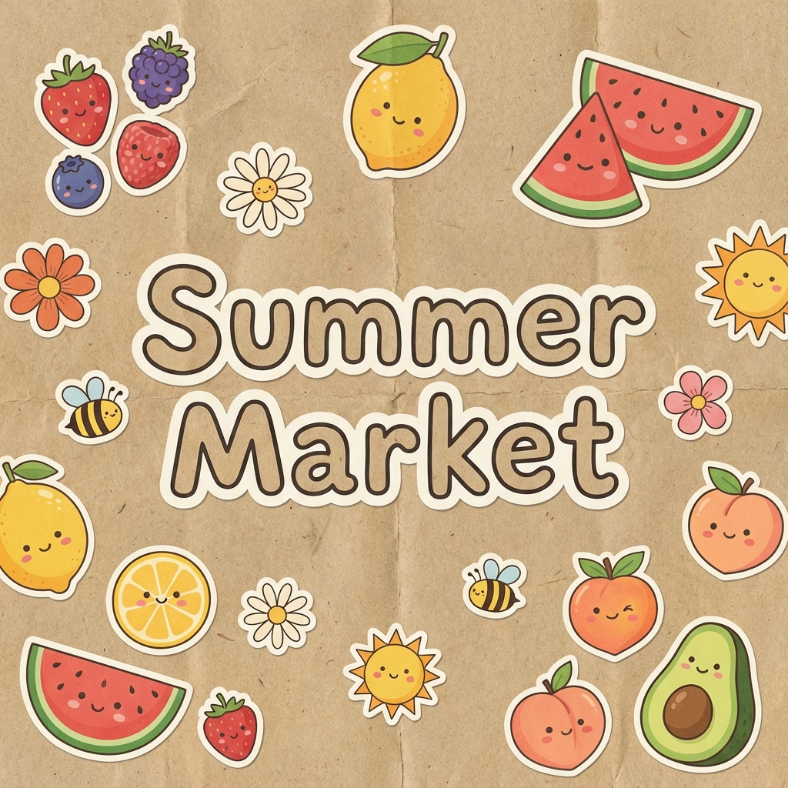

# 第 2 堂：社群貼文 - 圖文不求人 (Canva 主場)

- **主題**：IG/FB 社群行銷素材
- **工具**：Gemini (文案) + Ideogram (帶字圖) + Canva (快速拼)
- **重點方向**：
    - **Canva 的戰略地位**：社群貼文講求「量」與「速」，利用 Canva 模板庫節省 80% 時間。
    - **Gemini 腦力激盪**：產出 5 種不同語氣 (幽默、專業、感性) 的貼文文案。
    - **Ideogram 應用**：解決 AI 生成文字亂碼問題，製作帶有精準標題的圖片。
- **實作產出**：一組圖文並茂的節慶促銷輪播圖 (Carousel)。

## 雙軌實戰任務 (Dual-Track Specs)
#### **第 2 堂：社群貼文 - 節慶促銷輪播圖 (Carousel)**

- **學習主軸**：Ideogram 生字圖 + Canva 快速排版。
- **【主題 A：3C 產品/電競週邊特賣】**
    - **風格**：**故障藝術 (Glitch Art)** - 賽博龐克、高對比、霓虹。
    - **規格**：主標題「CYBER WEEK」、黑底亮色。
    - **參考文案內容 (Reference Copy)**：
        - **標題**：CYBER WEEK 瘋狂大促
        - **副標題**：全面 3 折起，限時 72 小時
        - **內文**：年度最強檔，錯過再等一年！頂級電競配備、3C 周邊，現在入手最划算。
    - **Prompt 進階三部曲 (由淺入深)**：
        1. **Lv1 (基礎)**：`Cyberpunk poster. (賽博龐克海報)`
        2. **Lv2 (中階)**：`Poster design, "CYBER WEEK" text, neon colors. (海報設計，"CYBER WEEK"文字，霓虹色彩)`
        3. **Lv3 (高階)**：`Poster design, "CYBER WEEK" text in glitch font, neon green and purple, cyberpunk city background, high contrast, negative space at the bottom for details. (海報設計，"CYBER WEEK"文字採用故障藝術字體，霓虹綠與紫，賽博龐克城市背景，高對比度，底部留白供詳細資訊)`
    - **範例作品**：
      
- **【主題 B：小農市集/季節水果祭】**
    - **風格**：**拼貼手帳風 (Scrapbook/Collage)** - 暖色調、紙質感。
    - **規格**：主標題「Summer Market」、米白底色。
    - **參考文案內容 (Reference Copy)**：
        - **標題**：Summer Market 夏日市集
        - **副標題**：在地小農，新鮮直送
        - **內文**：這個週末，來感受土地的溫度。當季水果、手作果醬、有機蔬菜，與您分享夏日的甜蜜。
    - **Prompt 進階三部曲 (由淺入深)**：
        1. **Lv1 (基礎)**：`Market poster. (市集海報)`
        2. **Lv2 (中階)**：`Poster design, "Summer Market", fruits, paper texture. (海報設計，"Summer Market"，水果，紙張紋理)`
        3. **Lv3 (高階)**：`Poster design, "Summer Market" text in hand-drawn font, fresh fruits, paper texture background, cute stickers style, clean layout for event info. (海報設計，"Summer Market"文字採用手繪字體，新鮮水果，紙張紋理背景，可愛貼紙風格，乾淨版面供活動資訊)`
    - **範例作品**：
      