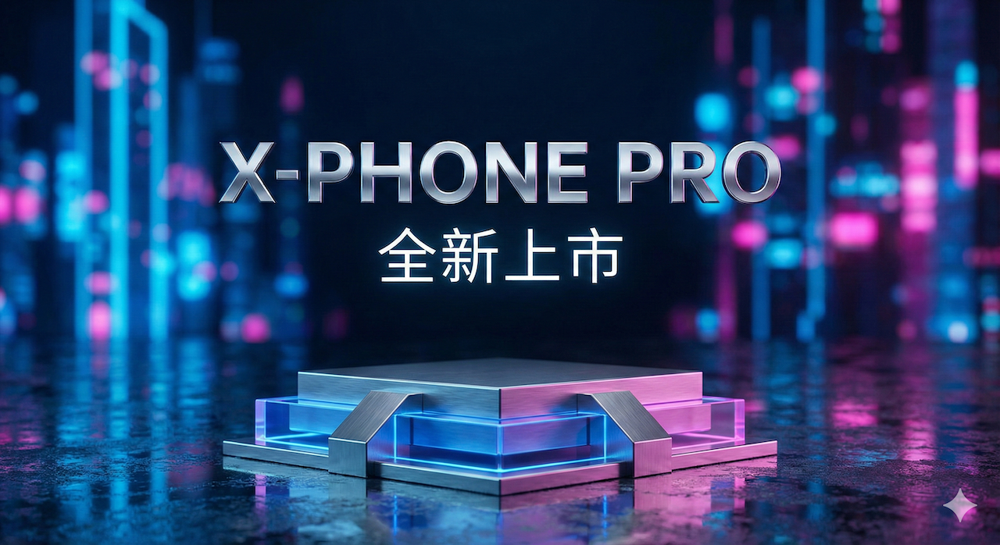

# 第 3 堂：商品情境 - 虛擬攝影棚 (Affinity 主場)

- **主題**：商品去背與情境合成
- **工具**：Affinity Photo/Designer + AI 背景生成
- **重點方向**：
    - **光影一致性**：學習如何調整素材的亮度、對比與色溫，使其與 AI 背景完美融合。
    - **透視與比例**：理解視平線 (Horizon Line) 與物體比例，避免合成感過重。
    - **陰影繪製**：使用 Affinity 的筆刷或圖層樣式製作真實的接觸陰影 (Contact Shadow)。
- **實作產出**：一張高質感的商品情境合成圖。

## 雙軌實戰任務 (Dual-Track Specs)
#### **第 3 堂：商品情境 - 虛擬攝影棚**

- **學習主軸**：AI 生成透視背景 + Affinity 商品合成。
- **【主題 A：科技新品發表】**
    - **風格**：**賽博龐克/霓虹 (Cyberpunk/Neon)** - 暗調、發光、反射。
    - **主角**：最新款智慧型手機或電競耳機。
    - **參考文案內容 (Reference Copy)**：
        - **標題**：超越極限，定義未來
        - **副標題**：X-Phone Pro 全新上市
        - **內文**：搭載次世代 AI 晶片，極致效能，瞬間覺醒。體驗前所未有的速度與流暢。
    - **Prompt 進階三部曲 (由淺入深)**：
        1. **Lv1 (基礎)**：`賽博龐克桌面背景，留白 (Cyberpunk table background, copy space)`
        2. **Lv2 (中階)**：`產品攝影背景，霓虹燈光，潮濕表面，產品空間 (Product photography background, neon lights, wet surface, space for product)`
        3. **Lv3 (高階)**：`產品展示台，未來城市散景背景，霓虹藍粉燈光，反射地板，高科技氛圍，8k 高解析度，上方留白供標題與文案使用 (Product display podium, futuristic city background with bokeh, neon blue and pink lighting, reflective floor, high tech vibe, 8k resolution, negative space on top for headline and copy)`
    - **範例作品**：
      
- **【主題 B：手工皂/香氛蠟燭】**
    - **風格**：**自然禪意 (Zen/Natural)** - 木質、陽光、植物。
    - **主角**：手工皂或精油瓶。
    - **參考文案內容 (Reference Copy)**：
        - **標題**：回歸純粹，自然森活
        - **副標題**：Pure Life 手工植萃系列
        - **內文**：嚴選天然草本精華，溫和洗淨，不造成肌膚負擔。讓沐浴成為一場與大自然的對話。
    - **Prompt 進階三部曲 (由淺入深)**：
        1. **Lv1 (基礎)**：`木桌背景，留白 (Wooden table background, copy space)`
        2. **Lv2 (中階)**：`產品攝影背景，木桌，陽光，窗戶陰影，乾淨區域 (Product photography background, wooden table, sunlight, window shadow, clean area)`
        3. **Lv3 (高階)**：`產品展示背景，鄉村風木桌，透過窗簾的柔和晨光，綠葉陰影，SPA 氛圍，自然光，左側寬敞留白 (Product display background, rustic wooden table, soft morning sunlight through curtains, green leaves shadow, spa atmosphere, natural lighting, wide copy space on the left)`
    - **範例作品**：
      