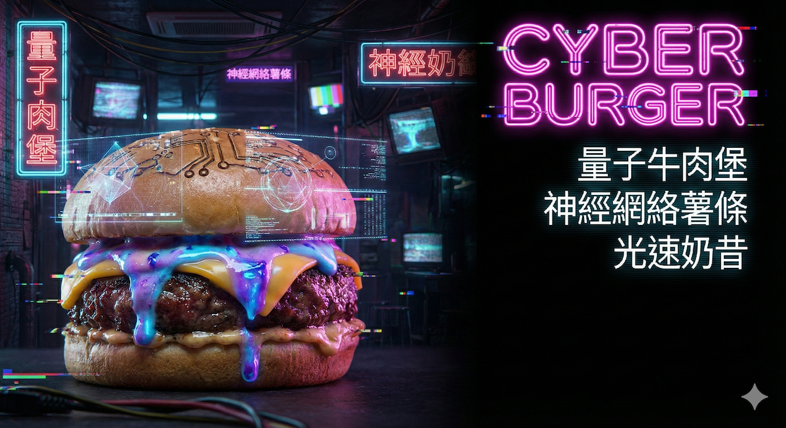
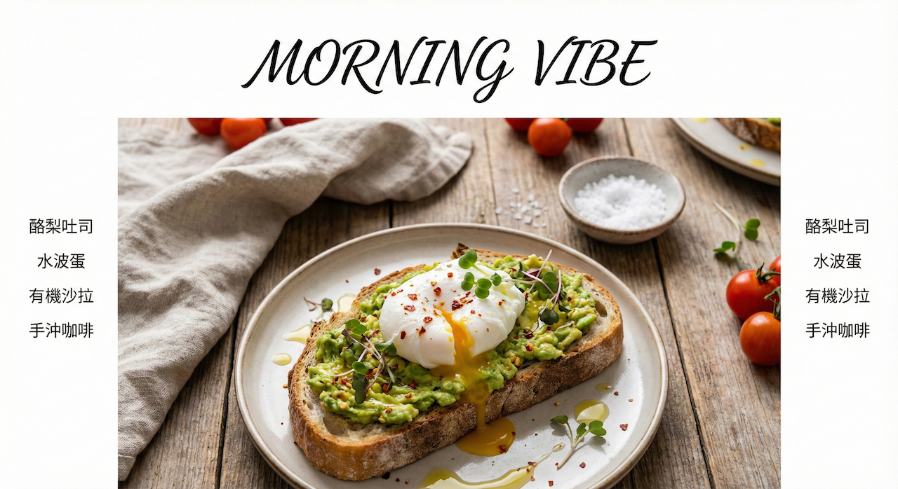

# 第 4 堂：菜單設計 - 視覺味蕾行銷

- **主題**：菜單排版與資訊層級
- **工具**：AI 食物生成 + Affinity Publisher/Designer
- **重點方向**：
    - **視覺動線**：引導顧客視線，從高利潤商品到加購選項。
    - **字體搭配**：標題與內文的字體選擇，營造品牌氛圍。
    - **網格系統**：使用 Grid 系統進行整齊且易讀的排版。
- **實作產出**：一份單頁式精選菜單。

## 雙軌實戰任務 (Dual-Track Specs)
#### **第 4 堂：菜單設計 - 視覺味蕾行銷**

- **學習主軸**：AI 生成食物插圖 + Affinity 文字排版。
- **【主題 A：電競酒吧/未來咖啡廳】**
    - **風格**：**故障藝術/高科技 (Glitch/High-Tech)** - 黑底、螢光綠/紫、數位感。
    - **菜色**：能量飲料、像素漢堡、晶片薯條。
    - **參考文案內容 (Reference Copy)**：
        - **標題**：CYBER BURGER
        - **副標題**：未來能量補給站
        - **內文**：
            - **像素漢堡** $180：經典牛肉排搭配數位起司
            - **晶片薯條** $80：酥脆口感，運算速度加倍
            - **能量飲料** $120：瞬間回血，再戰一局
    - **Prompt 進階三部曲 (由淺入深)**：
        1. **Lv1 (基礎)**：`霓虹漢堡，暗色背景，留白 (Neon burger, dark background, copy space)`
        2. **Lv2 (中階)**：`賽博龐克風格漢堡，發光醬汁，暗色背景，菜單空間 (Cyberpunk style burger, glowing sauce, dark background, space for menu)`
        3. **Lv3 (高階)**：`[主體] 美味漢堡搭配全像投影裝飾與發光醬汁 + [環境] 昏暗的賽博龐克餐廳，霓虹燈光照明 + [構圖] 側面視角，漢堡位於左側，右側暗色背景留白供菜單文字排版 + [風格] 電影級燈光，數位故障效果，誘人美食攝影 + [參數] 8k 解析度，微距攝影，高對比 (Subject: Delicious burger with holographic garnish and glowing sauce, Environment: Dim cyberpunk restaurant with neon lighting, Layout: Side view, burger on left, dark negative space on right for menu text, Style: Cinematic lighting, digital glitch effect, appetizing food photography, Parameters: 8k resolution, macro photography, high contrast)`
    - **範例作品**：
      
- **【主題 B：有機早午餐/慢食餐廳】**
    - **風格**：**雜誌排版 (Kinfolk Style)** - 大量留白、襯線體、低飽和度。
    - **菜色**：酪梨吐司、手沖咖啡、希臘優格。
    - **參考文案內容 (Reference Copy)**：
        - **標題**：Morning Ritual
        - **副標題**：開啟美好的一天
        - **內文**：
            - **酪梨吐司** $220：新鮮酪梨與酸種麵包的完美相遇
            - **手沖咖啡** $150：衣索比亞耶加雪菲，花果香氣
            - **希臘優格** $180：搭配季節水果與蜂蜜
    - **Prompt 進階三部曲 (由淺入深)**：
        1. **Lv1 (基礎)**：`酪梨吐司，白底，留白 (Avocado toast, white background, copy space)`
        2. **Lv2 (中階)**：`白盤上的酪梨吐司，俯視，適合文字的乾淨背景 (Avocado toast on white plate, top view, clean background for text)`
        3. **Lv3 (高階)**：`[主體] 頂級酪梨吐司搭配水波蛋 + [環境] 鄉村風木桌，亞麻餐巾，柔和自然光 + [構圖] 俯視平拍 (Flat lay)，餐盤位於下方，上方與兩側大量留白供菜單項目排列 + [風格] 美食雜誌風，清新，有機生活感 + [參數] 高畫質，柔和光影，色彩鮮豔 (Subject: Gourmet avocado toast with poached egg, Environment: Rustic wooden table, linen napkin, soft natural lighting, Layout: Flat lay, plate at bottom, large negative space above and sides for menu items, Style: Food magazine style, fresh, organic lifestyle vibe, Parameters: High quality, soft lighting, vibrant colors)`
    - **範例作品**：
      